# Sim Racer — Virtual Motorsport Championships on Your Hand! 🏎️

Hi! This is the most ambitious project I'm currently working pm, and is about virtual motorsport.

I'm a big fan of cars, especially when it comes to racing, so I found in this project a way to join a passion of mine with the opportunity to learn new technologies and practice my programming skills.

## What is Sim Racer? 🤔

_PS: This is not the project's final name. I just didn't manage to think in anything better than it so far._ 😂

It is, basically, an application that allows the **creation of virtual motorsport championships**. But, more important: **all the calculation of the championship standings** is done automatically based on the race results.

## Sign In & Sign Up Screens

You can manually create your account, with email and password, or you can sign in with social providers, like Google and Apple.

|     Welcome Screen     |     Sign In Screen     |     Sign Up Screen     |
| :--------------------: | :--------------------: | :--------------------: |
|  | 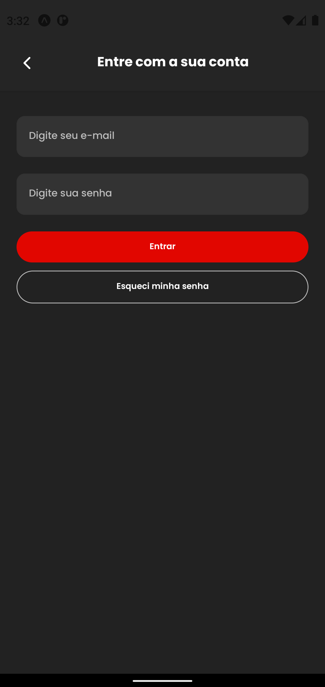 | 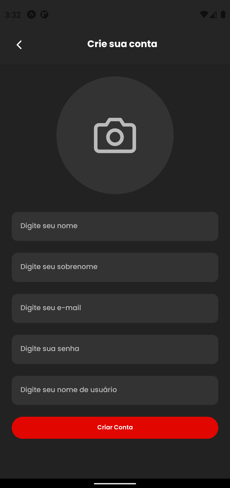 |

## Championship Creation Process

The first step to create a championship is to define it's basic details, like the name, platform (Playstation, Xbox or PC) and description.

Then, you can select the tracks which will be present on the championship, alongside with their race dates.

|      Championship Basic Details       |          Championship Tracks          |        Championship Race Dates        |
| :-----------------------------------: | :-----------------------------------: | :-----------------------------------: |
| 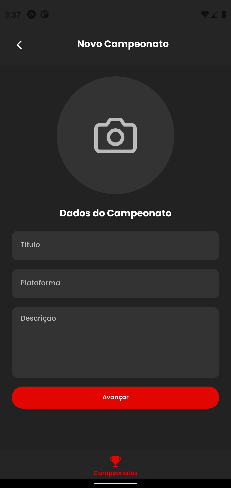 | 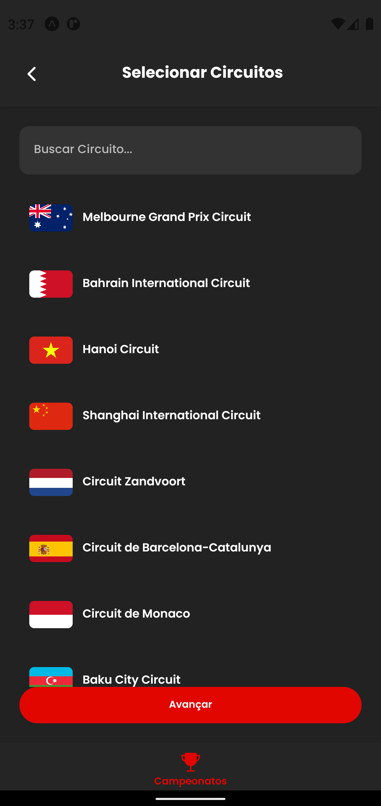 | 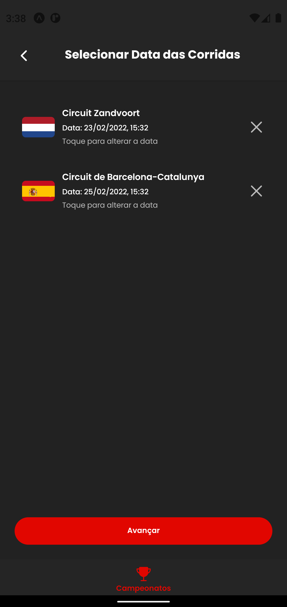 |

Now, you define the championship's scoring system. Basically, you tell the app how many points each driver will receive per race position. This is necessary to calculate the driver and team standings.

You also define the teams (which are optional) and the drivers which will participate of the championship. You can assign teams for them as well.

|      Championship Scoring System      |          Championship Teams           |         Championship Drivers          |
| :-----------------------------------: | :-----------------------------------: | :-----------------------------------: |
| 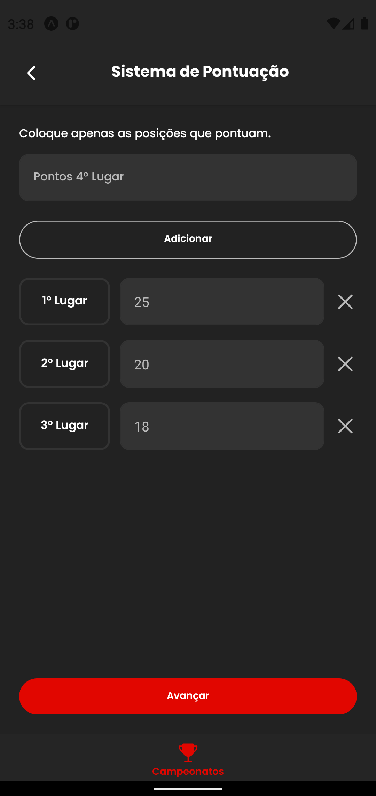 | 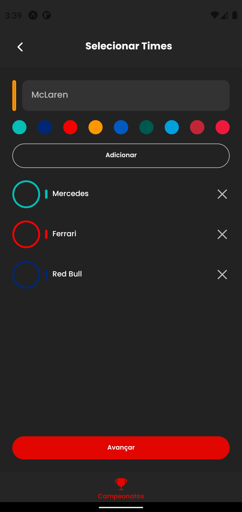 | 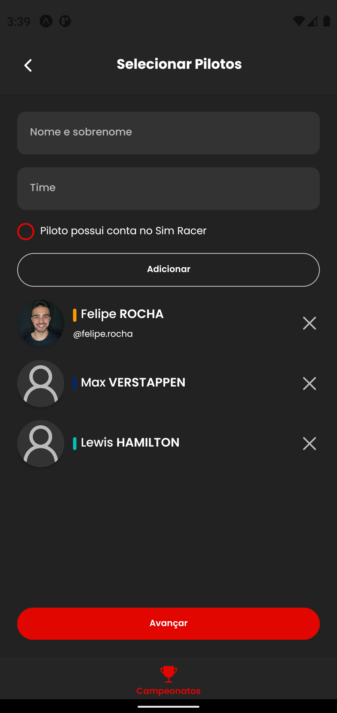 |

You are getting there! Now, you just need to define bonifications (like extra points for fastest lap, for example) and/or penalties (points deduction for a collision, for example).

These bonifications and penalties will be assignable to drivers in the races. They will affect, of course, the championship's driver and team standings.

|      Championship Bonifications       |      Championship Penalizations       |
| :-----------------------------------: | :-----------------------------------: |
| 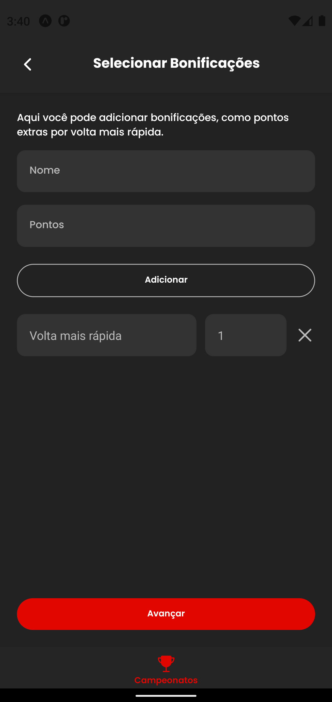 | 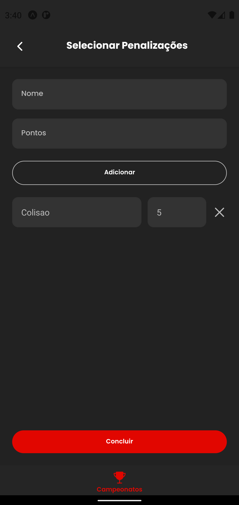 |

## Championship Listing

In the home page, you can see all the championships that you created and that you are participating. You can also see their details by pressing on them.

|        Championship List         |        Championship Details #1         |        Championship Details #2         |
| :------------------------------: | :------------------------------------: | :------------------------------------: |
| 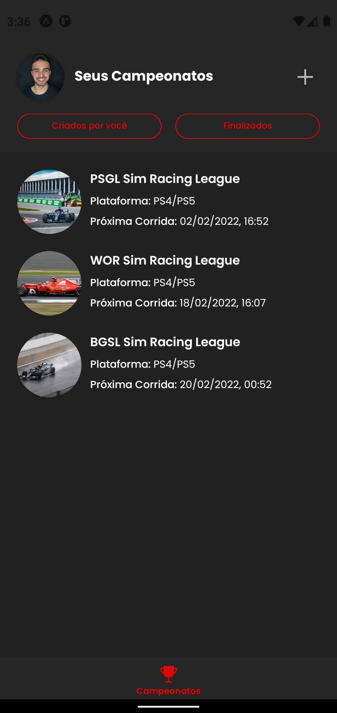 | 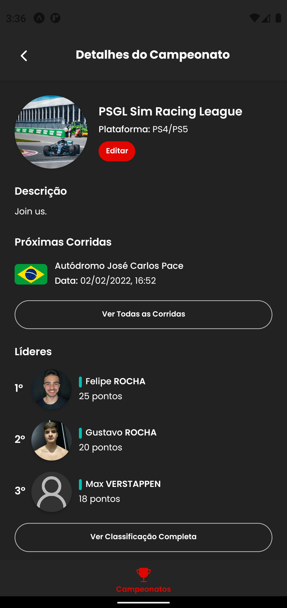 | 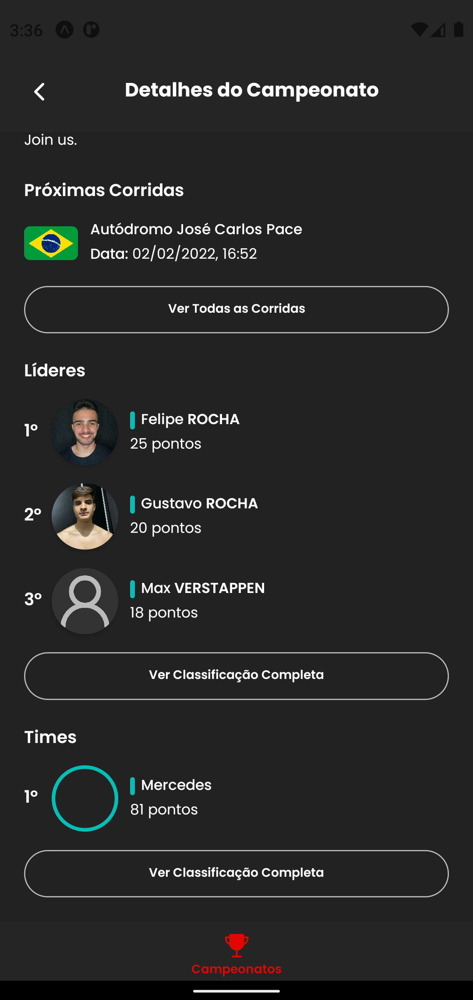 |

The details screen contain information like the next race and the leading drivers and teams. You also have the option to edit the championship if you are one of the admins.

You also can, of course, see the full team and driver standings.

|  Championship Driver Standings  |  Championship Team Standings  |
| :-----------------------------: | :---------------------------: |
| 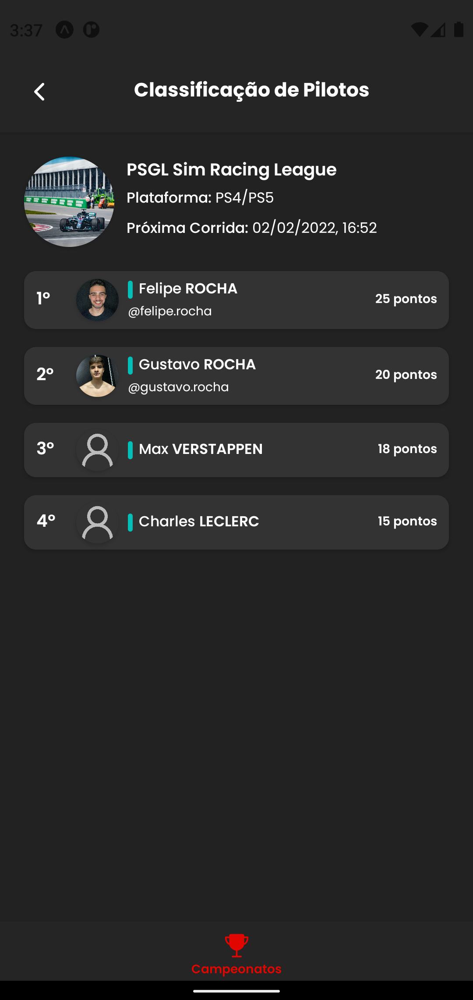 | 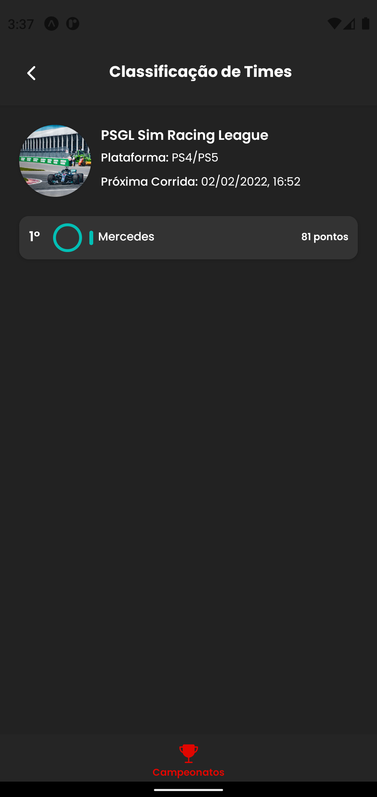 |

## Championship Edition

As I mentioned above, you can edit the championship if you are one of the admins by pressing on the "Edit" button.

|        Championship Edition         |
| :---------------------------------: |
| 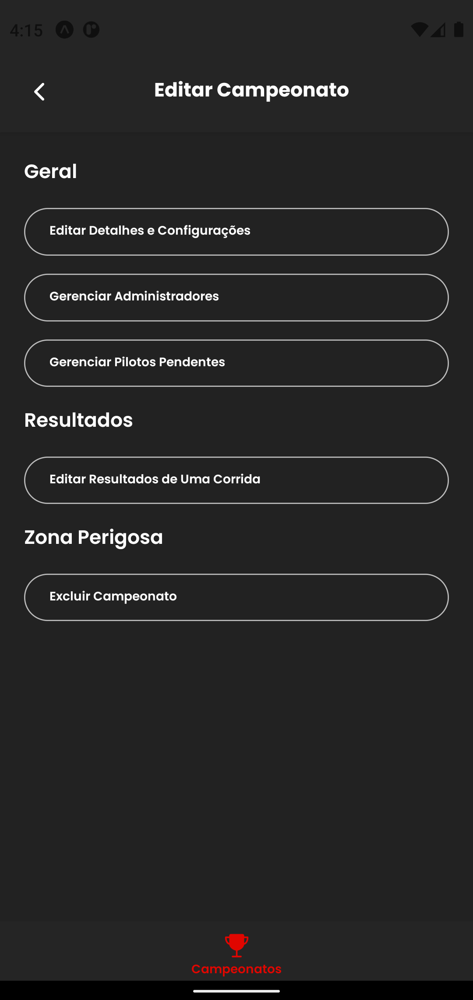 |

You will be able to edit the following informations:

- Details and Settings (all that we defined in the creation process, like teams, drivers, races etc.)
- Manage Administrators (users that will be able to also edit the championship)
- Manage Pendent Drivers (users will also be able to request the enter in a championship)
- Edit Race Results
- Delete the Championship

Buuuut, all of this is still in development. This document will be updated as I make progress.

## Implemented Functionalities (Done ✅)

- ✅ Championship Creation

- ✅ Championship Listing

- ✅ Championship Details

## Functionalities to Be Implemented (To Do 🚀)

- 🚀 Championship Edition (specially race results)

- 🚀 User Profile (with their statistics, like wins and titles count)

## Technologies Used 🛠

- **Front-end:** React Native, TypeScript, Redux, Redux Thunk & React Native Testing Library for testing.

- **Back-end:** Node.js, TypeScript, Jest & Supertest for testing. Clean Architecture principles are also widely used, like decoupling, layers separation and Dependency Injection.

- **Database:** MongoDB with Mongoose.

## Test Coverage 🐐

For me, a good testing coverage is indispensable for builiding a good and scalable product. So, in this project, testing is one of my main priorities.

Currently, the test coverage is:

- **Back-end:** 98%
- **Front-end:** 80%

My goal is to achieve, at least, more 90% of coverage on the front-end as well.

## Get In Touch 👋

Feel free to contact me if you have any doubts, considerations or suggestions about the project. Your opinion is very appreciated! My socials:

- LinkedIn: https://www.linkedin.com/in/felipe-rocha-034871172/
